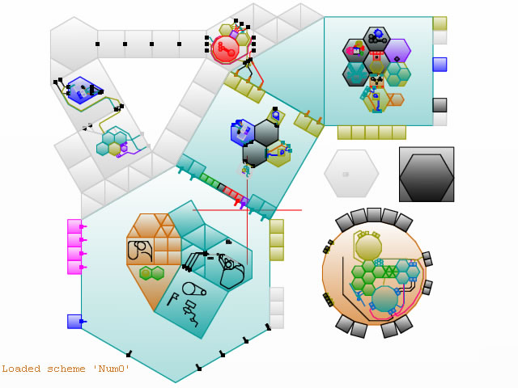
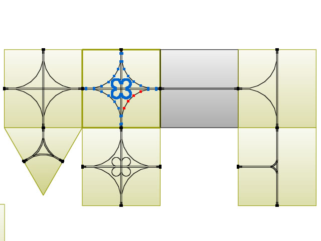
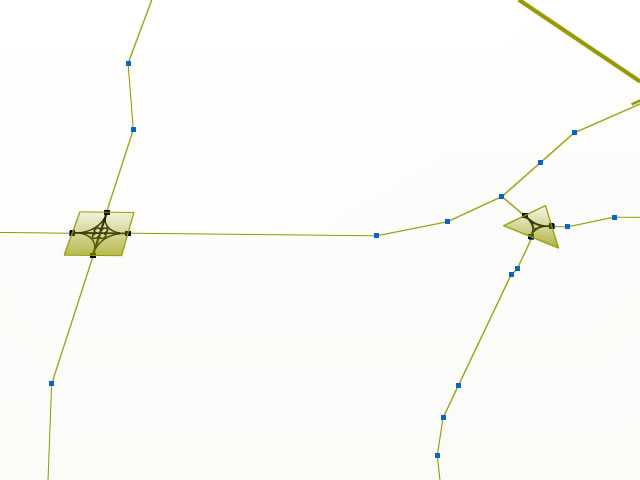
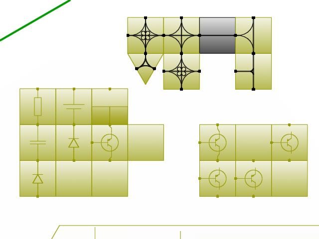
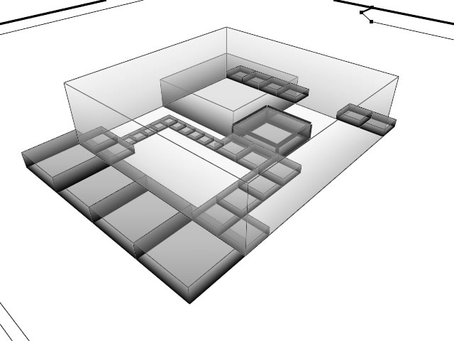
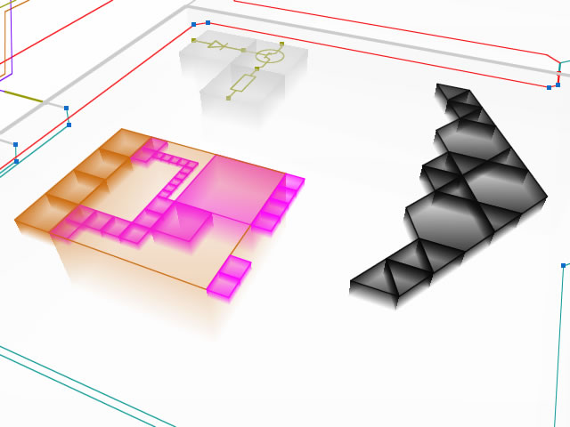
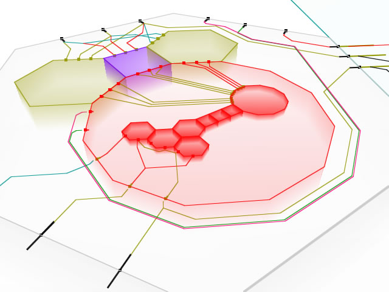

# Sienna

Other screenshots

## Controls

### Common

| Command                   | Function                                         |
| ---                       |  ---                                             |
|`[Ctrl]+[~] / [Escape]`    |  Toggle console                                  |
|`[Alt]+[E/D],[R/F]`        |  Toggle graphics blending modes                  |
|`[F9]`                     |  Toggle 'inverse video' mode                     |
|`[Alt]+[Enter]`            |  Toggle fullscreen mode                          |
|`[Alt]+[=/-]`              |  Adjust gamma correction for dark theme          |

### N-gon scheme editor

| Command                   | Function                                         |
| ---                       |  ---                                             |
|`[LeftMouse]`              |  Create, paste, select, drag objects             |
|`[RightMouse]`             |  Pan view, toggle menu, select menu item         |
|`[MiddleMouse]`            |  Incline viewpoint, 'arc rotate' in the perspective mode |
|`[MouseWheel]`             |  Zoom in/out                                     |
|`[Ctrl]`                   |  Hold to select multiple objects                 |
|`[Delete]`                 |  Delete selected objects                         |
|`[Backspace]`              |  Delete last created node                        |
|`[Space]`                  |  Update node information and line connections    |
|`[H]`                      |  Hold to draw lines with the arc helper          |
|`[U],[I],[O]`              |  Set port type: **U**ndefined, **I**nput, **O**utput |
|`[Q]/[W]`                  |  Change polygon type                             |
|`[A]/[S], [Alt]+[Wheel]`   |  Change color                                    |
|`[Z]/[X], [Shift]+[Wheel]` |  Rotate object                                   |
|`[=]/[-], [Ctrl]+[Wheel]`  |  Scale object                                    |
|`[Ctrl]+[C]`               |  Copy selected nodes                             |
|`[Ctrl]+[V]`               |  Paste selected nodes                            |
|`[Ctrl]+[O]`               |  Load scheme from current slot                   |
|`[Ctrl]+[S]`               |  Save scheme to current slot ('Num0' by default) |
|`[NumPad0..9]`             |  Load scheme from specified slot                 |
|`[Ctrl]+[NumPad0..9]`      |  Save scheme to specified slot                   |
|`[F11]`                    |  Toggle gradient mode                            |
|`[F12]`                    |  Toggle perspective/orthographic view            |
|`[Alt]+[F12]`              |  Toggle volume rendering mode (perspective view) |

Use console commands to set names, descriptions, and behaviours of selected nodes

| Command                           | Function                         |
| ---                               | ---                              |
|`nn NewName`                       |  Set **n**ode **n**ame           |
|`nt I[K]`                          |  Set **n**ode **t**ype           |
|`nd New description\r\ngoes here`  |  Set **n**ode **d**escription    |

Only `~I[KeyCode]` input node types are currently supported.

### Code editor

Most keys and keyboard shortcuts work just like they do in any text editor on the Windows platform,
with these additions:

| Command                   | Function                                         |
| ---                       |  ---                                             |
|`[RightMouse]`             |  Hold to scroll text (like MouseImp's 'DirectScroll') |
|`[F9]`                     |  Toggle 'inverse video' mode                     |
|`[F4]`                     |  Reset interpreter                               |
|`[F5]`                     |  Continue                                        |
|`[F10]`                    |  Step over                                       |
|`[F11]`                    |  Step into                                       |
|`[Shift]+[F11]`            |  Step out                                        |
|`[F12]`                    |  Toggle hexadecimal numbers                      |
|`[ScrollLock]`             |  Toggle execution                                |
|`[CapsLock]`               |  Toggle skipping breakpoints                     |
|`[Ctrl]+[S]`               |  Save file                                       |

Continuous execution is active as long as ScrollLock and CapsLock are active, and there
must be at least one '!!!'-breakpoint in the executable code. Missing breakpoint causes
hanging of execution because the interpreter updates the screen every time a breakpoint
is hit.

### Programming language

Note that the supported programming language is stack-oriented. The key feature is
the order of execution of various syntax nodes: expressions are executed in direct order,
lists - **in reverse**, and finally list-items are executed in direct order again.
"Atoms" are only supported by the syntax parser, but they are expected to be executed
in direct order as well.

